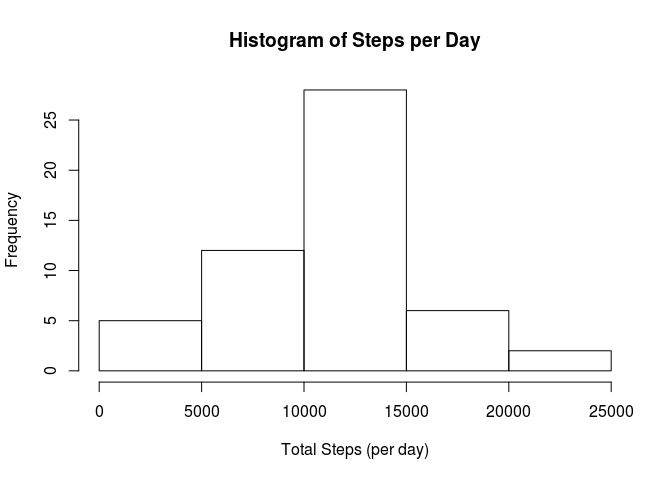
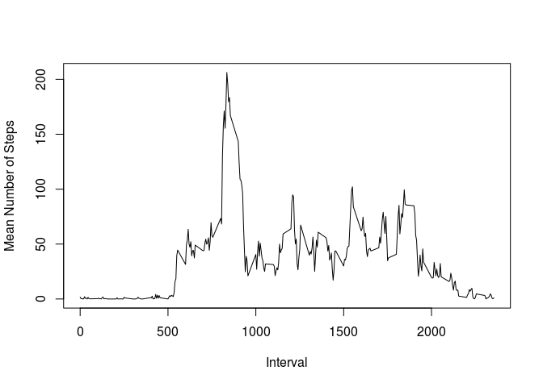
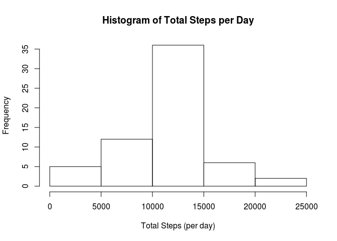
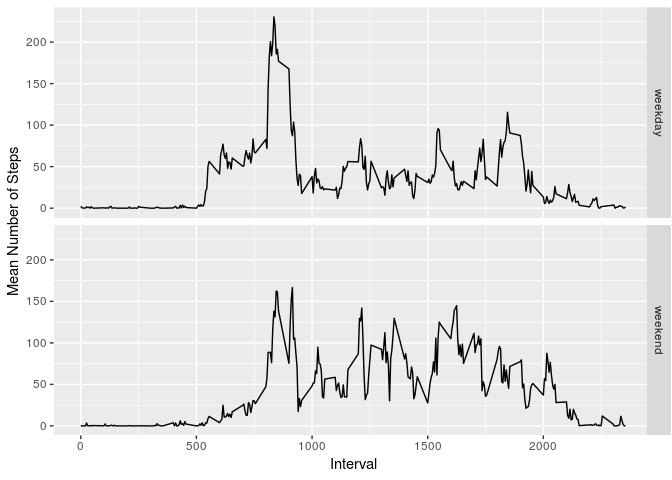

    knitr::opts_chunk$set(echo = TRUE)

Loading and preprocessing the data
----------------------------------

    stepInfo = read.csv("./activity.csv")
    stepInfoNoNA <- stepInfo[is.na(stepInfo$steps)==FALSE,]
    totalStepsPerDay <- aggregate(stepInfoNoNA$steps, by=list(stepInfoNoNA$date), FUN=sum)
    hist(totalStepsPerDay$x, xlab = "Total Steps (per day)", main="Histogram of Steps per Day")

    mean(totalStepsPerDay$x)

    ## [1] 10766.19

    median(totalStepsPerDay$x)

    ## [1] 10765

What is the average daily activity pattern?
-------------------------------------------

    meanByInterval = aggregate(stepInfoNoNA$steps, by=list(stepInfoNoNA$interval), FUN=mean)
    plot(x=meanByInterval$Group.1, y=meanByInterval$x, type = "l", xlab="Interval", ylab="Mean Number of Steps")

    meanByInterval[meanByInterval$x == max(meanByInterval$x), 1]

    ## [1] 835

Imputing missing values
-----------------------

    mergedForImputation<-merge(x=stepInfo, y=meanByInterval, by.x="interval", by.y="Group.1", all = TRUE)
    mergedForImputation$steps[is.na(mergedForImputation$steps)] = mergedForImputation$x[is.na(mergedForImputation$steps)]
    totalStepsPerDayImp <- aggregate(mergedForImputation$steps, by=list(mergedForImputation$date), FUN=sum)
    hist(totalStepsPerDayImp$x, xlab = "Total Steps (per day)", main = "Histogram of Total Steps per Day")

    mean(totalStepsPerDayImp$x)

    ## [1] 10766.19

    median(totalStepsPerDayImp$x)

    ## [1] 10766.19

Are there differences in activity patterns between weekdays and weekends?
-------------------------------------------------------------------------

    library(ggplot2)
    isWeekend <- weekdays(as.Date(mergedForImputation$date, '%Y-%m-%d')) %in% c("Sunday", "Saturday")
    weekendWeekday <- isWeekend
    weekendWeekday[isWeekend == TRUE] <- "weekend"
    weekendWeekday[isWeekend == FALSE] <- "weekday"
    mergedForImputation$weekendWeekday = weekendWeekday
    aggregatedWeekday <- aggregate(mergedForImputation$steps, by=list(weekdayOrWeekend = mergedForImputation$weekendWeekday, interval = mergedForImputation$interval), FUN=mean)
    plot <- qplot(data=aggregatedWeekday, x=aggregatedWeekday$interval, y=aggregatedWeekday$x, geom = "line")
    plot <- plot + facet_grid(aggregatedWeekday$weekdayOrWeekend~.) + ylab("Mean Number of Steps") + xlab("Interval")
    plot

